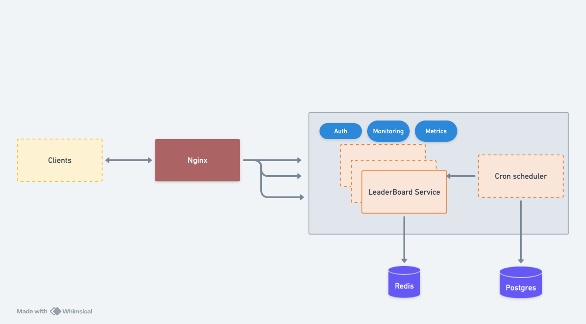

## 🏆 Leaderboard Service

The **Leaderboard Service** is a scalable, multi-container application that manages and displays leaderboards efficiently. It leverages **PostgreSQL for persistence**, **Redis for caching**, and supports **horizontal scaling** with multiple app instances.

### ⚡ Key Features

- **API Gateway (NGINX)** with **consistent hashing** ensures requests for the same `gameId` go to the same container for optimized in-memory leaderboard reads. Allows the local in-memory leaderboard data can be sharded across multiple application instances.
- **Hybrid Redis + PostgreSQL storage model** for performance and durability.
- **JWT-based authentication** to secure API endpoints.
- **Scheduled persistence** of in-memory leaderboards to PostgreSQL.
- **Monitoring & Metrics** using Prometheus.

---

### 📷 Architecture Diagram



This diagram illustrates the high-level architecture of the Leaderboard Service, showcasing the interaction between its components.

### 📌 System Components

#### 🚀 Clients (Users/Games API)

- Sends **score updates** and **fetches leaderboards** via REST API.

#### 🌐 API Gateway (NGINX)

- Routes requests to the appropriate backend **based on `gameId`**.
- Uses **consistent hashing** to maximize **in-memory reads**.

#### 🏅 Leaderboard Service (Node.js + Express)

- Handles score updates and leaderboard queries.
- Implements an in-memory cache using a hybrid Redis + PostgreSQL approach.

#### ⚡ Redis (Caching & Fast Lookups)

- Stores popular leaderboards.

#### 🛢️ PostgreSQL (Persistent Storage)

- Stores historical leaderboard data.
- Periodically updated from Redis using a write-behind caching strategy.

#### ⏳ Scheduler (Cron Jobs)

- Periodically persists (configurable) in-memory leaderboards to PostgreSQL.

#### 🔐 Authentication Middleware

- Uses JWT-based authentication to secure API endpoints.

#### 📊 Monitoring & Metrics

- Prometheus collects system metrics like response times, API hits, memory usage.

---

## ⚙️ Prerequisites

Ensure you have the following installed:

- **Docker** and **Docker Compose**.
- Secrets for **database password** (`db_password`) and **JWT secret** (`jwt_secret`) stored in:
  ```
  ./secrets/db_password.txt
  ./secrets/jwt_secret.txt
  ```

---

## ▶️ Running the Service

To start the service, run:

```bash
docker-compose up -d --build
```

---

## 🔌 API Endpoints

Postman collection added [here](./assets/LeaderBoard.postman_collection.json)

#### 1️⃣ Get Leaderboard

📌 **Endpoint:** `GET /leaderboard/{gameId}?limit={N}`  
🔹 **Description:** Fetches the current leaderboard for a given game.  
🔹 **Query Param:** `limit` (default: 10) – Number of top scores to retrieve.

##### ✅ Sample Request:

```bash
curl -X GET http://localhost/leaderboard/game-xxxx?limit=10 \
-H 'Authorization: Bearer <JWT_TOKEN>'
```

##### 📤 Sample Response:

```json
{
  "gameId": "game-xxxx",
  "leaderboard": [{ "userId": "Madan", "score": 30 }]
}
```

---

#### 2️⃣ Add Score

📌 **Endpoint:** `POST /leaderboard/{gameId}/update-score`  
🔹 **Description:** Adds a new score to the leaderboard.  
🔹 **Request Body:**

- `eventType`: Must be `"scoreUpdate"`.
- `userId`: User’s unique identifier.
- `score`: Score to be added (integer).
- `timestamp`: ISO format timestamp (cannot be in the future).

##### ✅ Sample Request:

```bash
curl -X POST http://localhost/leaderboard/game-xxxx/update-score \
-H "Content-Type: application/json" \
-H 'Authorization: Bearer <JWT_TOKEN>' \
-d '{
    "eventType": "scoreUpdate",
    "userId": "Madan",
    "score": 30,
    "timestamp": "2025-04-04T00:00:00.000Z"
}'
```

##### 📤 Sample Response:

```json
{ "message": "Score added successfully" }
```

---

## 🧪 Running Tests

To run the test suite, use:

```bash
docker-compose run test
```

---

## 📌 Notes

- Ensure `db_password` and `jwt_secret` are correctly configured **before** starting the service.
- The service exposes the following ports:
  - **App Instances:** `3000`, `3001`
  - **PostgreSQL:** `5432`
  - **Redis:** `6379`
  - **Nginx:** `80`
- **Scaling:** Supports **horizontal scaling** for handling high traffic efficiently.

---

## 🛠️ Key Assumptions & TODO

- Popularity for a game is based on the number of active users in the game.
- Postgres persistence can be used to re-populate the local cache if a local cache is lost due to app crash etc.
- New routes can be added to CRUD a game so that every game can produce an unique ID which can then be used as gameID on the API's.
- Nginx consistent hashing tradeoff: This optimizes in-memory reads at the cost of potential uneven load distribution
- Assumes most leaderboards fit in memory, with only high-traffic ones stored in Redis.
- Eviction strategy: Least accessed leaderboards may be offloaded to PostgreSQL.
- WebSockets/Event streams for real time communication with clients for updating the leaderboard, avoids client polling
